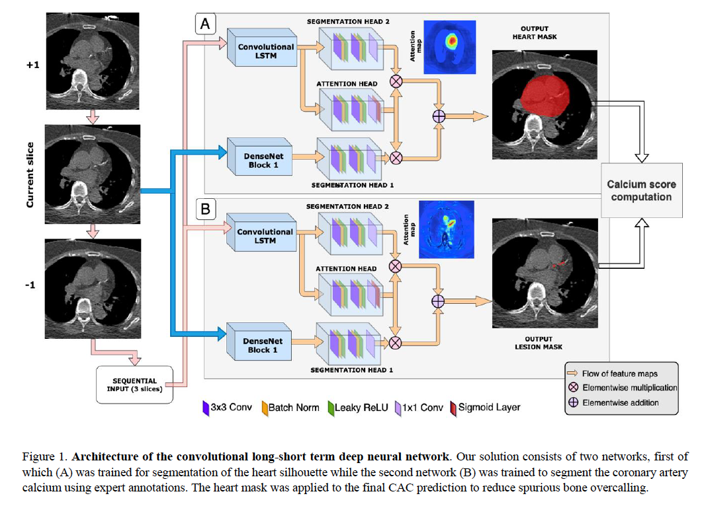

# CLSTM_CAC

## Overview

This repository contains the baseline architecture for the Convolutional LSTM network used in the paper: "Predicting mortality from AI-based cardiac volumes, mass, and coronary calcium on chest CT."

Recent advancements in artificial intelligence (AI) have potentially enabled the quantification of cardiac measures such as coronary artery calcium (CAC) and segmentation of cardiac chambers from non-gated CT imaging. We integrated our convolutional AI model which automatically measures CAC, with another AI model (TotalSegmentator) which automatically segments cardiac chamber volumes. The aim of our study was to evaluate the clinical potential of a fully automated AI pipeline that estimates CAC, cardiac chamber volumes, LV mass, and shape index when applied to low-dose (non-contrast and ungated) lung CT with respect to predicting clinical outcomes.


## CAC model
Coronary artery Calcium (CAC) automatically processed with the CLSTM-CAC model using the HRNet_CC_BY-NC.py.



## System Requirements
This model code is tested on Ubuntu 22.04 LTS Linux OS with Nvidia GeForce RTX 4090 (24Gb) GPU, and AMD Ryzen Threadripper PRO 5955WX 16-Cores.


## Python Dependencies
```
torch==1.13.1
torchvision==0.14.1
```

## Installation Instructions
+ Clone the repository from github
```
git clone https://github.com/qimagingAI/CLSTM_CAC.git
cd CLSTM_CAC
```
+ Install the dependencies
```
pip3 install -r requirements.txt
```


## References

1. Miller, R.J., Shanbhag A., et al. Deep learning coronary artery calcium scores from SPECT/CT attenuation maps improves prediction of major adverse cardiac events. J Nucl Med 64, 652-658 (2023). 
2. Pieszko, K., Shanbhag A., et al. Deep Learning of Coronary Calcium Scores From PET/CT Attenuation Maps Accurately Predicts Adverse Cardiovascular Events. JACC Cardiovasc Imaging 16, 675-687 (2023)
3. Killekar A, et al :	arXiv:2104.00138 (2022)
 
